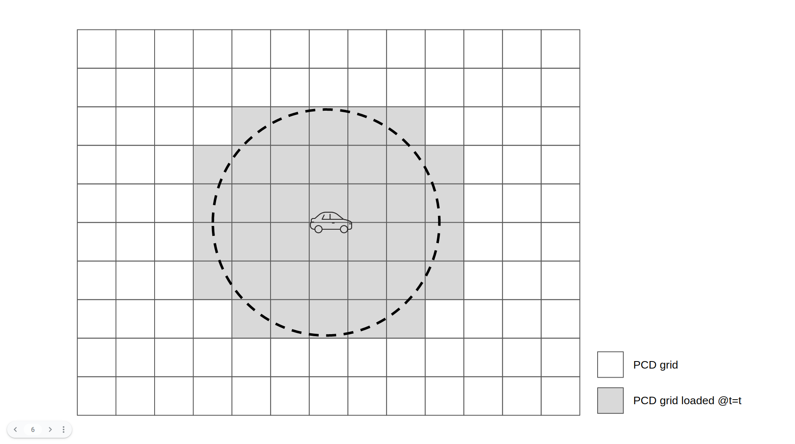
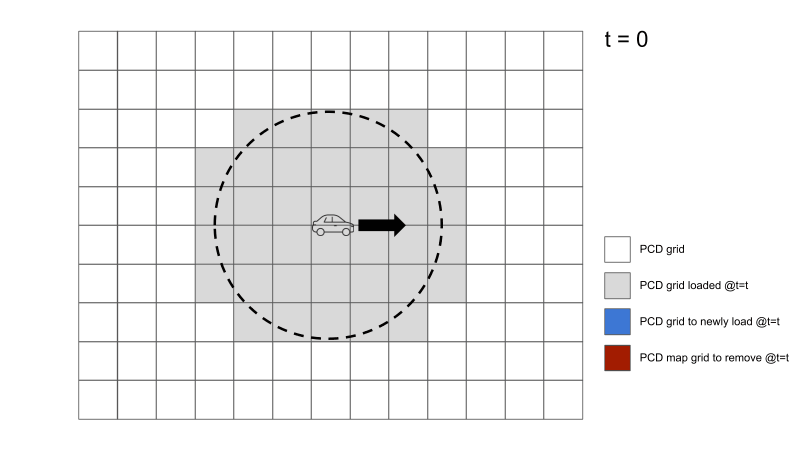

# autoware_map_msgs

## AreaInfo.msg

The message represents an area information. This is intended to be used as a query for partial / differential map loading (see `LoadPCDMaps.srv` section).

## PCDMapWithID.msg

The message contains a pointcloud data attached with an ID.

## LoadPCDMaps.srv

The service is used for various types of pointcloud map loading requests.

### Mode 1: Partial map loading

Given an area query (`AreaInfo`), the response is expected to contain the PCD maps (each of which attached with unique ID) whose area overlaps with the query.

### Mode 2: Differential map loading

Given an area query and the IDs that the client node already has, the response is expected to contain the PCD maps (each of which attached with unique ID) that...

- overlaps with the area query
- is not possessed by the client node

Let $X_0$ be a set of PCD map ID that the client node has, $X_1$ be a set of PCD map ID that overlaps with the area query, ${\rm pcd}(id)$ be a function that returns PCD data that corresponds to ID $id$. In this case, the response would be

- `loaded_pcds`: $\{ [id,{\rm pcd}(id)]~|~id \in X_1 \backslash X_0 \}$
- `already_loaded_ids`: $\{ id~|~id \in X_1 \cap X_0  \}$

