# autoware_v2x_msgs

## Virtual gate messages

### Overview

This message represents the status of the virtual gate for passing through the area managed by the facility.
The virtual gate treats area entry permission as a shared resource and controls vehicles by acquiring and releasing locks.
Each facility may support different protocols, but Autoware V2X component converts each protocol and this message.
This allows Autoware to handle facilities with different protocols with a unified message.

### Sequence

Because there is a time lag before commands are reflected, the vehicle must wait until it receives the status of the same sequence as the command it sent.
Until the vehicle receives the status, treat it as if it were unlocked.

### Gates

Specify the entrance and exit gate IDs. This is used to check if vehicles can pass simultaneously when multiple routes are possible within an area.
If omitted, it is treated as a lock for the entire area.

### Vehicle ID

This message does not include the vehicle ID, so add it in the V2X component if required by the communication protocol.
And if facilities publish multiple vehicle statuses, filter to only status for own vehicle.
